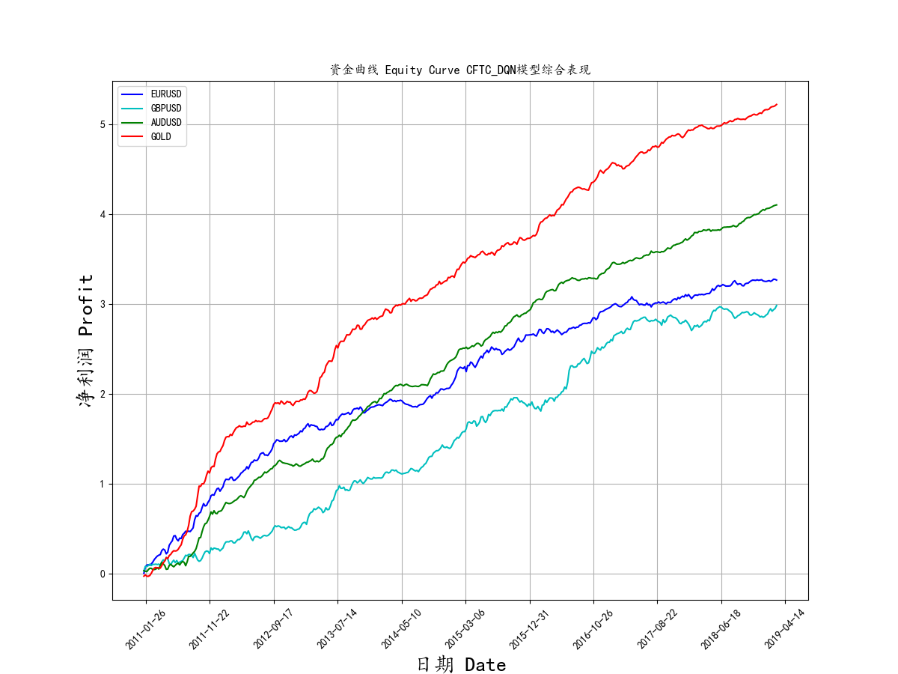
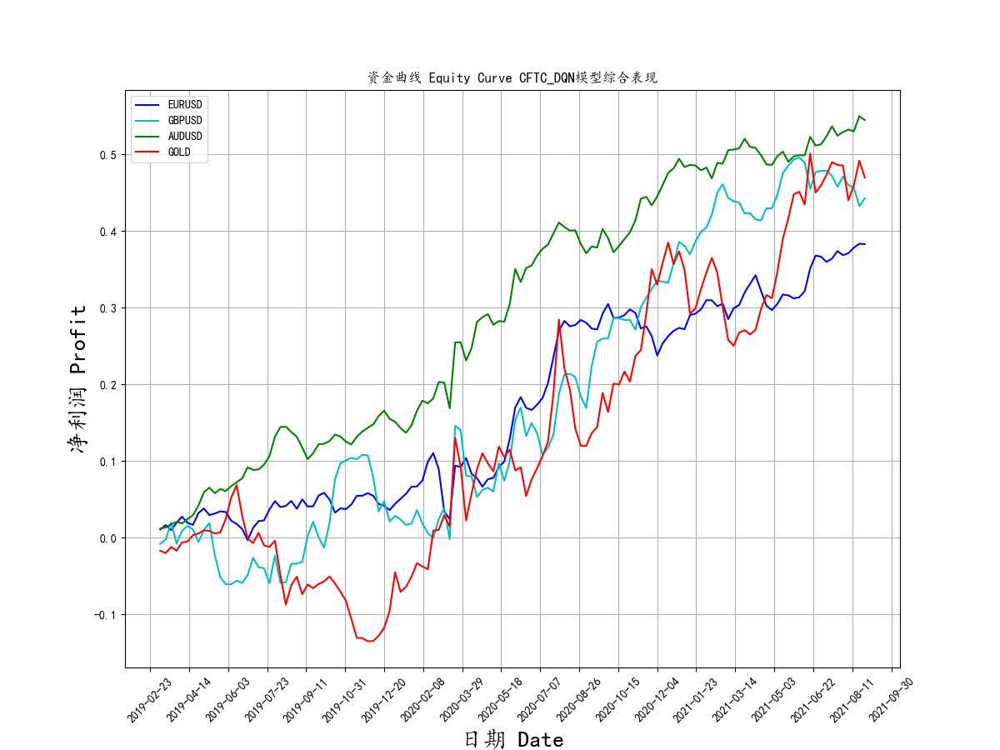
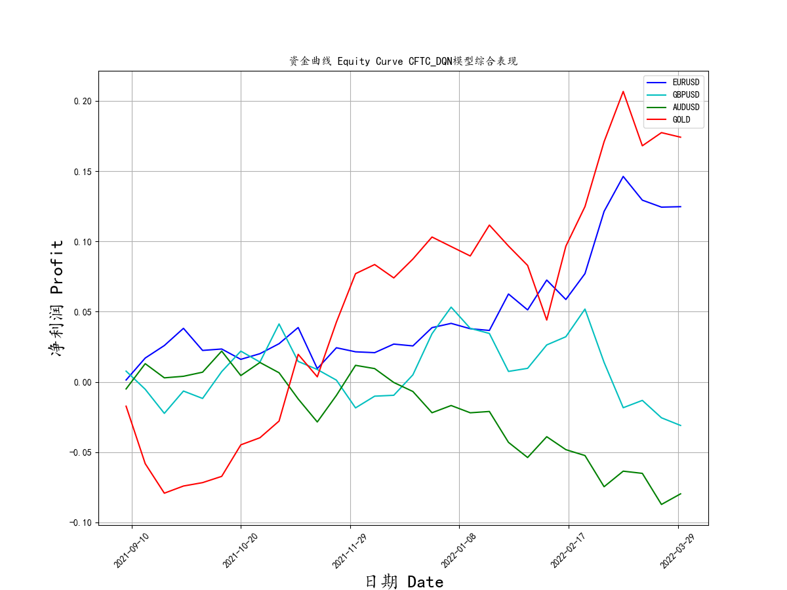

# CFTC_DQN
An reinforcement learning model for trading based onCFTC reports

I use 2008.1-2019.2, this time period data for training set. 2019.3-2021.8 for test set and real money test since 2021.9. Trading strategy is simple, algorithm reviews three weeks of CFTC reports and makes a trading decision: go long or short. It then holds the position for two weeks and then closes it out.
Trading symbols include EURUSD, GBPUSD, AUDUSD, GOLD.The following is Performance of CFTC_DQN trading model:

The figure above shows the performance of the model on the training set.

The figure above shows the performance of the model on the test set.Note that the profit is expressed as a decimal and is not reinvested using compound interest.For example, a 0.5 here in profit means profit of 50%.

The figure above shows the performance of the model on the real money test without manual intervention.The algorithm worked well during the Omicron epidemic and the Ukraine conflict, especially gold.

Let's say we add a little manual intervention, if the profit reaches 0.8 times ATR(period 3), we close half of the position, other unchanged.

## Create your own model

What is reinforcement learning? https://en.wikipedia.org/wiki/Reinforcement_learning

What is DQN? https://openai.com/blog/openai-baselines-dqn/

What is CFTC report? https://www.cftc.gov/MarketReports/CommitmentsofTraders/index.htm

How to make a DQN with tensorflow? https://www.tensorflow.org/agents/tutorials/1_dqn_tutorial

## data sources

CFTC and weekly price history data all in history folder.

CFTC history data from:https://www.cftc.gov/MarketReports/CommitmentsofTraders/HistoricalCompressed/index.htm

Price history data from my forex dealer:https://www.avatrade.com/

## CAUTIONS IN USE
1. Reinforcement learning models are black boxes, we can't check if it's working good or whether it fits the current market environment.
2. Markets are constantly changing, look at the yield curve of EURUSD, As the ECB's unlimited easing policy has led to increasing liquidity and lower volatility in EUR. When market conditions change, models must be retrained.
3. Make sure the model can survive a market crash such as 2008.7/2020.3/2021.12/2022.2 
4. Double check that the input data is correct, every input parameter still corresponds when you translate it into tensor.

